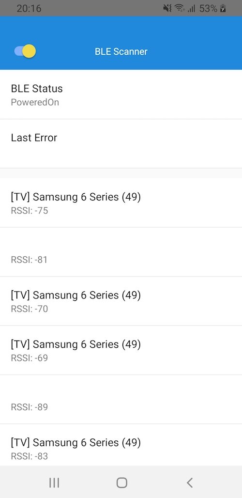

# React Native Bluetooth Low Energy Scanner

This is a quick and dirty prototype for a React Native app, that scans for Bluetooth Low Energy devices and displays device detections and their [RSSI](https://en.wikipedia.org/wiki/Received_signal_strength_indication).

<div align="center">
   
</div>

It uses:

- [react-native-ble-plx](https://github.com/Polidea/react-native-ble-plx)
- [react-native-elements](https://github.com/react-native-elements/react-native-elements)

## Getting started

Install dependencies:

```sh
yarn
```

### iOS

Make sure to install cocoapods (for macOS `sudo gem install cocoapods` or `brew install cocoapods`).

Install pod:

```sh
cd ios
pod install
cd ..
```

Start packager:

```sh
yarn start
```

Run app in simulator or connected iPhone:

```sh
yarn ios
```

### Android

Start packager:

```sh
yarn start
```

Run app in emulator or connected Android phone:

```sh
yarn android
```

## Troubleshooting

### Gradle problems

Consider this [Gradle issue](https://github.com/Polidea/react-native-ble-plx/issues/628#issuecomment-607473957).

### Android: Device is not authorized to use BluetoothLE

Open "Settings -> Apps -> blescanner -> Permissions -> Location -> Allow"
